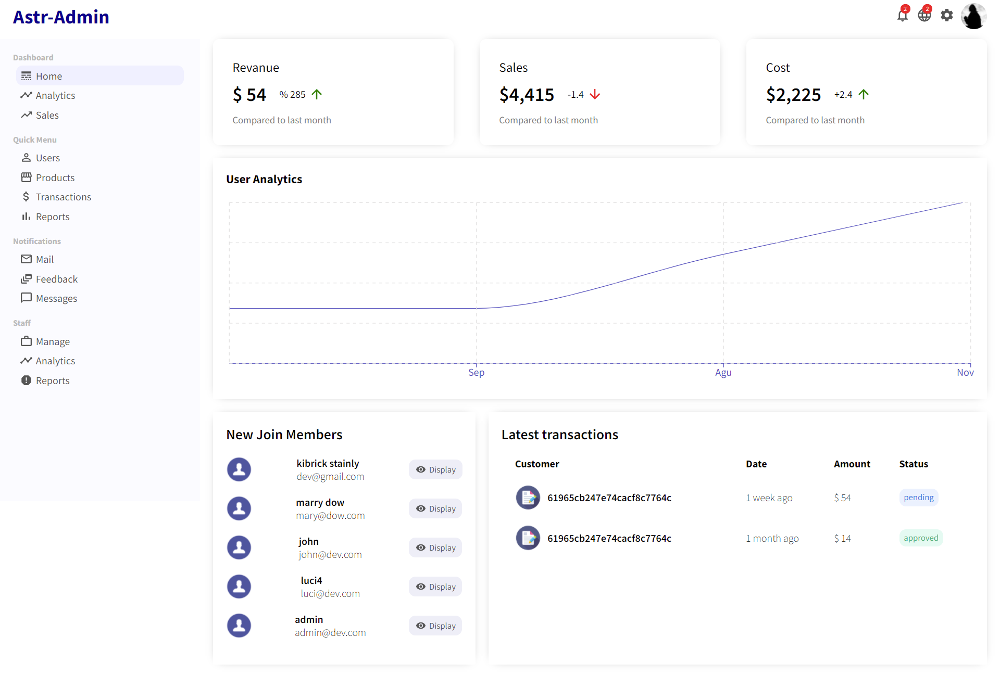
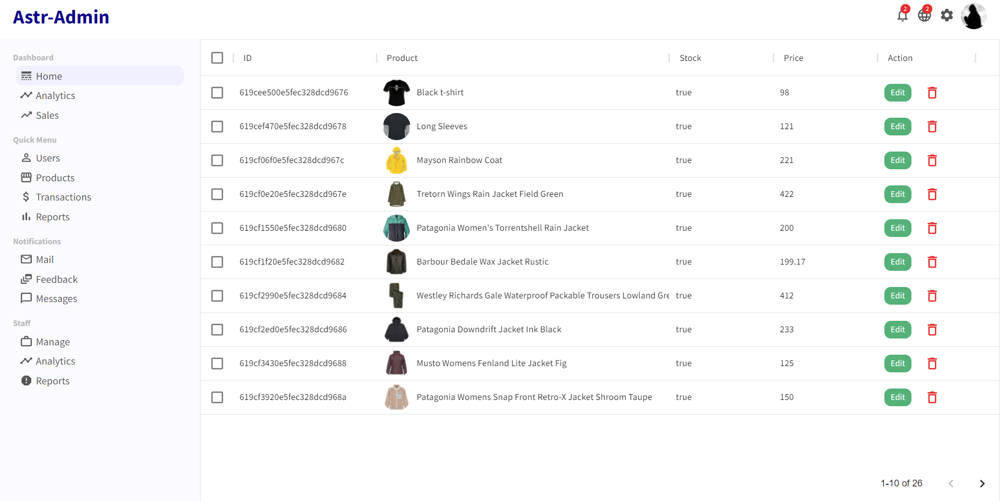
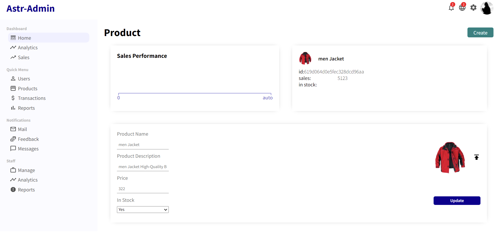
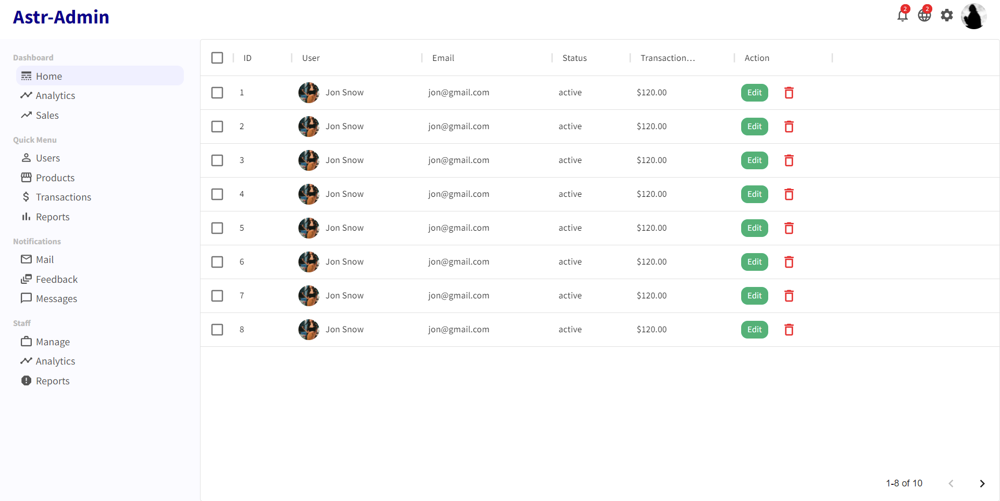
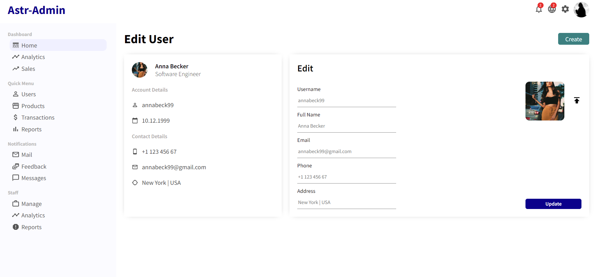

### Admin Panel Shop for E-Commerce App (REDUX - Stripe - JWT ) | ReactJS - MERN Stack Shopping App

## REST-API

To make all the http Requests, visit the **[SERVER SIDE](https://github.com/Astroth1984/ecommerce-REST-Api "Rest-API")** and follow the instructions.

## Installation

1. Clone the Repository: `git clone https://github.com/Astroth1984/Admin-Panel-Shop.git`
2. Install the required Dependencies: `npm install` or `yarn add`
4. Run Project: `npm start` or `yarn start`

## Login :

To have access to the platforme, to all Admin Roles and to all CRUD operators , login as admin with : 

```
  username : admin
  password: admin123
```

### Overview

## Admin Dashboard / Home Page:



## Products List



## Edit Product 



## Users List



## Edit User 


